# Title

## Project Overview

In this project, we utilize deep learning to predict future trajectories of aircraft in real-time using their incoming ADS-B flight data. We first establish the context of aircraft navigation and the necessity of accurate flight prediction methods. Next, we investigate Recurrent Neural Networks (RNNs), a type of neural network used for sequential prediction and temporal data, to solve the prediction problem. After training and fine-tuning our model, we evaluate its performance on masked flight data to the ground truth data, as well as baseline physics and modeling-based methods. Next, we evaluate the addition of an attention block for model performance. Finally, we discuss the significance of our model's relative performance in its real-world context and outline possibilities for future development.

Source code: [Repo](https://github.com/itannermahncke/deep-learning-trajectory-prediction)

## Introduction

### Context and Motivation for Trajectory Prediction

When you're flying a plane, how do you know where other aircraft are planning to go? In current aircraft systems, answering this question is a highly manual process. Significant time and money is invested in human-managed flight coordination, such as air traffic control, radio communication, and sharing of flight plans. Aircraft also regularly emit Automatic Dependent Surveillance - Broadcast (ADS-B) data, which describe their real-time motion kinematics at a frequent interval. These efforts are all to ensure that pilots can easily predict the intended trajectories of other aircraft in order to avoid a crash.

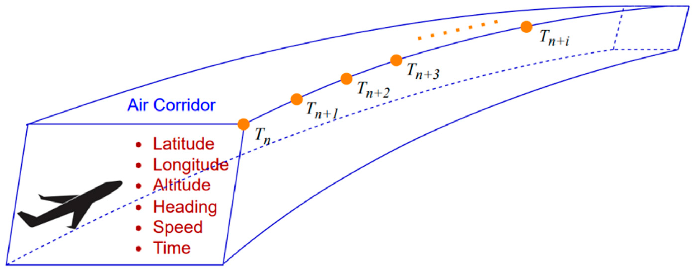

> **Fig 1** Diagram of an aircraft model in flight over time. The listed red values (latitude, longitude, altitude, heading, forward speed, and time) are all values present in an ADS-B data packet.

With the rise of autonomous aircraft (also known as unmanned autonomous vehicles, or UAVs), human- and pilot-based communication is no longer sufficient. In particular, due to limited onboard compute power, UAVs could never hope to adapt to all human-based trajectory communication methods. Instead, alternate autonomy tools must be applied to the problem of flight prediction such that UAVs can safely operate alongside humans in open airspace. Existing tracking methods generally utilize ADS-B data to perform classical state estimation for solving the trajectory prediction problem, which involves creating physics-based models for other aircraft, predicting their future states, and updating those predictions with ADS-B data. However, different types of aircraft all require unique physical models, and classical methods of state estimation can be completely blind to sudden or unusual maneuvers performed by pilots.


> **Fig 2** Photograph of a UAV designed by Wing, a delivery drone company.

Deep learning provides a potentially more robust avenue of solving the trajectory prediction problem for UAVs. Neural networks trained on large sums of historical ASD-B flight data can be more capable of predicting the flight maneuvers of different types of aircraft, as well as future maneuvers that are not kinematically obvious. However, a variable deep learning solution must be capable of acknowledging the temporal, sequential nature of flight data -- simple classification models aren't capable of this. Instead, only deep learning techniques capable of sequence prediction are up to the task of solving the trajectory prediction problem. 

With the context of the trajectory prediction problem for UAVs and existing methods of mitigation in mind, we now explore a deep learning-based sequence prediction technique as a potential solution.

### How Does Sequential Deep Learning Work?

#### Intro to Recurrent Neural Networks

Recurrent Neural Networks (RNNs) are a type of neural network capable of predicting future items in a sequence of temporal data. The RNN is made up of layers for each prior input in the sequence. Each layer utilizes a block called a Recurrent Unit, which calculates a "Hidden State" value to propagate information about prior inputs to the layer's own unit. This means that new sequence predictions are informed by all prior values in the given sequence. RNNs also use an identical set of weights and biases for each internal layer, meaning they can train quickly even with large sequences of data or with datasets of varying sizes.


> **Fig 3** Diagram of an unrolled Recurrent Neural Network predicting a new item in a 2-item sequence of stock prices.

However, the RNN's identical weights lead to a severe problem of RNNs: the vanishing/exploding gradient problem. Essentially, any set of weights will be reapplied to the Hidden State over and over again as the RNN's layers are unrolled. If those weights are greater than 1, the values in the Hidden States will be amplified by said value again and again until they are unreasonably high. Similarly, if those weights are less than 1, the values in the hidden states will shrink until they are near-zero. As a result, RNNs are not a reliable solution for any sequence prediction problems with input sequences greater than a few pieces of data.

#### LSTMs As Modified RNNs

Long Short-Term Memory (LSTM) is an extension of the vanilla RNN that eradicates the vanishing/exploding gradient problem. LSTM-based networks, unlike RNNs, maintain both a Hidden State (short-term memory) and a Cell State (long-term memory). Unlike the Hidden State, the Cell State does not include any tunable weights, preventing the vanishing/exploding gradient problem. The LSTM updates the Cell State and Hidden State by applying a set of three blocks to each input value in the given sequence.

The first block, the Forget Gate, determines the percentage of the long-term memory that will be kept in the Cell State going forward. This percentage is calculated by applying the sigmoid activation function to a weighted sum of the input value and the Hidden State value, which maps the value to a percentage between 0 and 1. The weights on these values are learned by the network during training.


> **Fig 4** Diagram of the Forget Gate in an LSTM unit, containing a sigmoid function to calculate percentage of long-term memory kept.

The second block, the Input Gate, determines what value to add to the long-term memory in the Cell State. This block applies the inverse tangent activation function to a weighted sum of the input value and the Hidden State value, which maps the value to a scale of -1 to 1. This value represents a potential value to add to the long-term memory. The block also utilizes the sigmoid activation function with weights, just like the Forget Gate, to determine how much of that potential value to actually add to the long-term memory. After both functions are run, the final new value is added to the existing long-term memory in the Cell State.


> **Fig 5** Diagram of the Input Gate in an LSTM unit, containing a tanh function to calculate new long-term memory, as well as a sigmoid function to calculate percentage of new long-term memory kept.

The third and final block, the Output Gate, determines what value to add to the short-term memory in the Hidden State, which is ultimately returned by the LSTM unit as a final value. This block does the same steps as the Input Gate, but instead of using the long-term memory to modify the short-term memory with inverse tangent and sigmoid, it does the reverse. In this way, the long-term memory's stability keeps the short-term memory from exploding and preserves information from earlier timesteps, while the short-term memory is most influenced by training weights and recent input values.


> **Fig 6** Diagram of the Output Gate in an LSTM unit, containing a tanh function to calculate new short-term memory, as well as a sigmoid function to calculate percentage of new short-term memory kept. The result of the Output Gate is the final output of the LSTM unit.

In practice, an LSTM-based network would apply the three blocks that make up a single LSTM unit to each item in the given sequence, in order. The resultant output of the final LSTM unit is the prediction for the next item in the sequence. The long-term memory and short-term memory work together to balance old information with new, while also avoiding the vanishing/exploding gradient problem that vanilla RNNs struggle with. As a result, LSTMs are a popular choice for sequence prediction in many contexts.

### Bidirectional LSTMs

Bidirectional LSTMs are an extension of the vanilla LSTM model that introduces a second LSTM unit to each item in the sequence. Unlike the original system, which propagate memory of earlier information to inform and enrich later information, the secondary units propagate memory of later information to inform earlier information. This extension is useful for sequences in which later tokens can inform and explain earlier tokens. In the case of this project, implementation and performance of a BiLSTM-based network was explored alongside a vanilla LSTM-based network.

## Methodology

### Data Collection and Preprocessing

#### OpenSky Sensor Network

To train a model capable of predicting flight future flight trajectories, a substantial and detailed flight dataset is necessary. This project utilizes data from the [OpenSky Sensor Network,](https://opensky-network.org/) a database of open-source air traffic and flight data intended for research purposes. OpenSky provides live air traffic data as well as historical data from several years of data collection across the world.

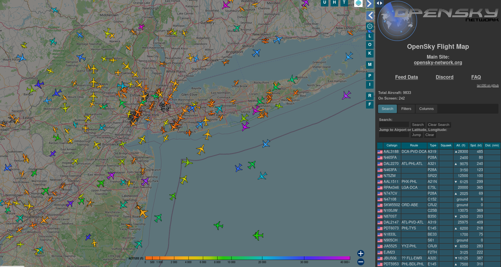

> **Fig 7** Screenshot from the OpenSky website's live air traffic data feed over New York City, USA. Taken on May 5th, 2026, at 1:38pm EST.

This project specifically relies on data from [OpenSky's Weekly 24 Hours of State Vector Data](https://s3.opensky-network.org/data-samples/states/README.txt) datasets. Each dataset is a compilation of ADS-B flight broadcasts from hundreds of concurrent flights available in 10 second update intervals. Each row of data provides an identifying flight signature and timestamp, as well as latitude, longitude, velocity, heading, and baro/geoaltitude, which are all of the state variables desired for our prediction model. Because each flight has such frequent datapoints, the dataset is flexible both for long-horizon trajectory prediction as well as predictions with real-time correction.

#### Data Preprocessing

The preprocessing pipeline begins by selecting the relevant variables from the raw time series data and applying feature scaling using a StandardScaler, which normalizes each variable to have zero mean and unit variance. This scaling is applied before sequence construction to ensure consistent feature magnitudes scaling. The data is then segmented into individual flights and only flights that are longer than the lookback length plus 1 are kept. Within each flight, overlapping sequences are generated using a sliding window of size the lookback plus 1. From each sequence, the first look_back timesteps form the input (x_seq), and the final timestep forms the target (y_seq), producing  input-output pairs. The dataset is then split into training and testing sets according to a specified ratio, converted into PyTorch tensors, and loaded into as batches DataLoaders without shuffling to maintain the timeseries.

We also experimented with a delta variant where the model was fed absolute values but was trained to predict the change in state values. In the delta variant of the pipeline, the only difference is in how to target is computed. The target is now the difference between the next scaled state and the current scaled state. The model receives the absolute states but learns to predict the next change or delta.

### Model Design Decisions

We implemented and trained both an LSTM-based network and a BiLSTM-based network for this project. The networks each operate on six channels of input: latitude, longitude, velocity, heading, geoaltitude, and baroaltitude. The networks also each output a six-channel prediction representing the same state vector.

Additionally, we designed both networks to be stateless, meaning that no memory was preserved between each lookback sequence. This was to prevent the models from overfitting to entire flights rather than learning to recognize common flight patterns across the dataset.

For our model training, we ran sweeps over the following parameters: batch size, lookback length, hidden dimension size, number of layers, and learning rate. Loss was computed using Mean Absolute Error (MAE), which measures the average absolute difference between predicted and true values across all features and samples in a batch. In the absolute prediction model, the loss compares the predicted next state to the true next state. In the delta version, the loss instead compares the predicted change in state to the true change.

### Refining Models with Parameter Sweeps

#### Simple LSTM
With our LSTM, we ran three parameter sweeps with each sweep narrowing down the values for each parameter. Below are the first parameter values and last parameter values we swept. Of note, for the LSTM sweeps we initially decided not to sweep batch size but for the BiLSTM training we chose to sweep batch size.

First Sweep

```
"parameters": {
    "batch_size": {"values": [64]},
    "look_back": {"values": [20, 50, 100]},
    "hidden": {"values": [32, 64, 128]},
    "layer": {"values": [1, 2]},
    "learning_rate": {"values": [0.0001, 0.0005, 0.001]},
}
```

Third Sweep
```
"parameters": {
    "batch_size": {"values": [64]},
    "look_back": {"values": [20, 30, 50]},
    "hidden": {"values": [192, 256, 320]},
    "layer": {"values": [1]},
    "learning_rate": {"values": [0.0002, 0.0003, 0.0004]},
}
```

For our third sweep, we ran a total of 50 runs. Each run randomly picked parameter values from the provided parameter sweep values. Below are the results from the runs. The visual below shows the loss the run achieved and shows what parameters it ran with.

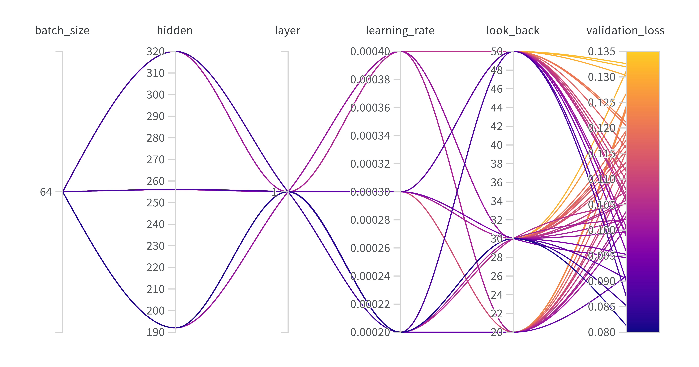

> **Fig 8** Visualization of the runs in the third LSTM parameter sweep. The first four axes represent the parameter values. Where a run's line intersects with the axis represents what parameter value was used. The validation loss axis shows what final loss the run achieved.

Our best performing model achieved a final loss of 0.081 and best loss of 0.0731.

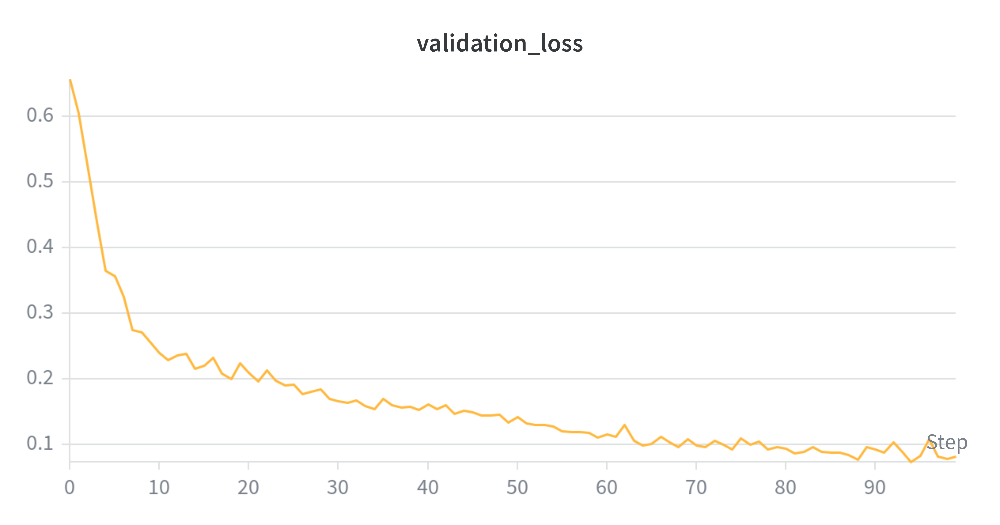

> **Fig 9** Plot of loss over steps/epochs for our simple LSTM. Loss is calculated with MAE.

Its parameters were a batch size of 64, lookback of 30, hidden size of 192, layer amount of 1, and learning rate of 0.0002.

#### Bidirectional LSTM

For our BiLSTM, we ran a total of five parameter sweeps, narrowing down the values for each parameter depending on the sweep results. Below are the first parameter values we swept and the last parameter values we swept.

First Sweep
```
"parameters": {
    "batch_size": {"values": [32, 64]},
    "look_back": {"values": [10, 20, 30, 40, 50]},
    "hidden": {"values": [64, 96, 128, 192]},
    "layer": {"values": [1, 2]},
    "learning_rate": {"values": [0.00005, 0.0001, 0.0002, 0.0005, 0.001]},
},
```

Fifth Sweep
```
"parameters": {
    "batch_size": {"values": [32, 40, 48, 56]},
    "look_back": {"values": [18, 20, 22]},
    "hidden": {"values": [176, 192, 208, 224]},
    "layer": {"values": [1]},
    "learning_rate": {
        "distribution": "log_uniform_values",
        "min": 8e-5,
        "max": 1.8e-4,
    },
},
```
For our fifth sweep, we ran a total of 60 runs. In this, the parameter values were also selected from the ones provided. Below are the results.

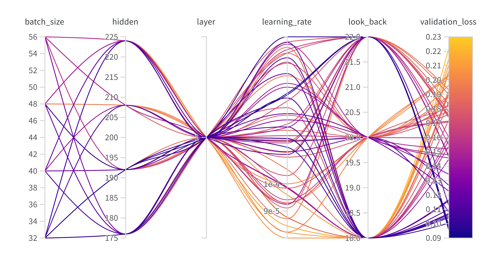

> **Fig 10** Visualization of the runs in the fifth BiLSTM parameter sweep. The first four axes represent the parameter values. Where a run's line intersects with the axis represents what parameter value was used. The validation loss axis shows what final loss the run achieved.

Our best performing model achieved a final loss of 0.095 and lowest loss of 0.0828. 

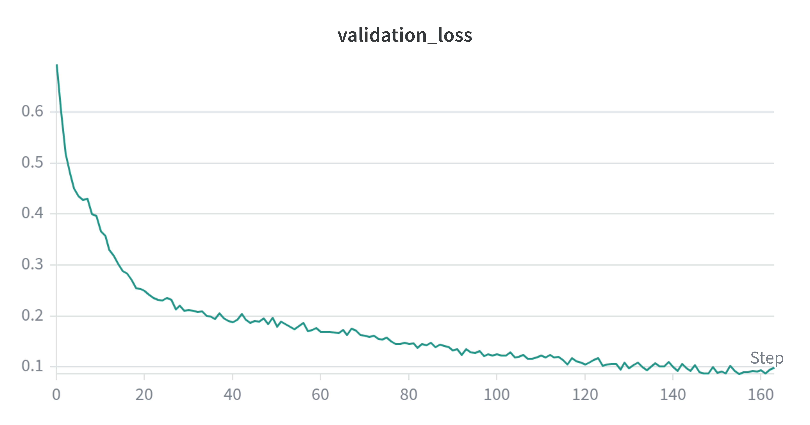

> **Fig 11** Plot of loss over steps/epochs for our BiLSTM. Loss is calculated with MAE.

Its parameter values were a batch size of 32, lookback of 22, hidden size of 192, layer amount of 1, and learning rate of ~0.0001.

#### Delta BiLSTM

We also repeated the process for the delta variant of our BiLSTM. We ran one sweep with this model over the following parameters. 
```
"parameters": {
    "batch_size": {"values": [32, 48, 64, 96, 128]},
    "look_back": {"values": [18, 20, 22, 25]},
    "hidden": {"values": [128, 160, 192]},
    "layer": {"values": [1]},
    "learning_rate": {
        "distribution": "log_uniform_values",
        "min": 1e-4,
        "max": 8e-4,
    },
},
```

We ran a total of 50 runs where once more parameter values were randomly selected from the ones provided. Below are the results from the runs. 

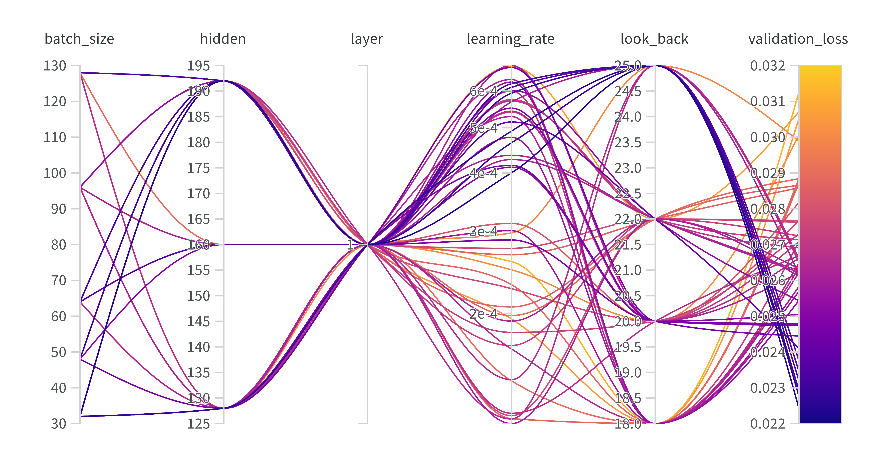

> **Fig 12** Visualization of the runs in the delta BiLSTM parameter sweep. The first four axes represent the parameter values. Where a run's line intersects with the axis represents what parameter value was used. The validation loss axis shows what final loss the run achieved.

Our best performing model achieved a loss of 0.022. 

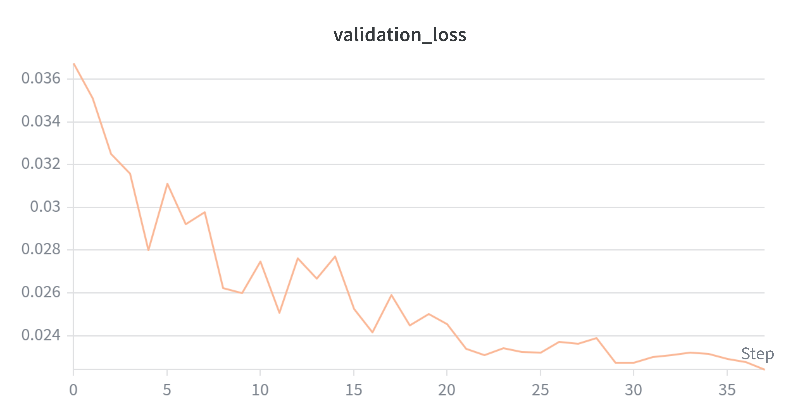

> **Fig 13** Plot of loss over steps/epochs for our delta BiLSTM. Loss is calculated with MAE.

Its parameters were a batch size of 32, lookback of 25, hidden size of 192, layer amount of 1, and learning rate of ~0.0004.

## Model Performance Comparison Results

The tables below show the performance of each LSTM type across all six state channels. In each plot, the model's prediction sequence is compared with ground truth ADS-B data from a specified flight in the dataset. The model makes each new prediction using a prior sequence of ADS-B data up to the lookback size. After the dotted blue line, the model switches to making each new prediction using a prior sequence of its own predictions. This is meant to simulate forecasting a trajectory over a longer-than-immediate time horizon. In a real-world context, a new forecast would be generated each time a new row of ADS-B data was received from a tracked aircraft.

### Vanilla LSTM Performance

These plots show the performance of the simple LSTM across all six state channels.
|  |  |
:--:|:--:
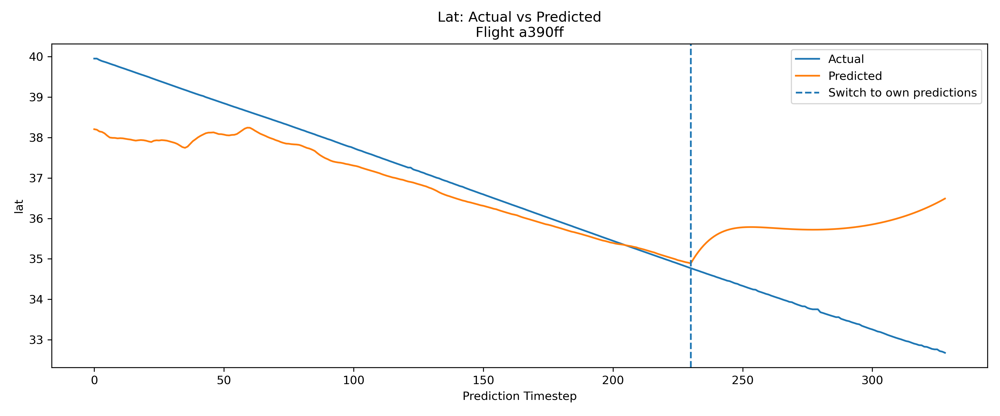 | 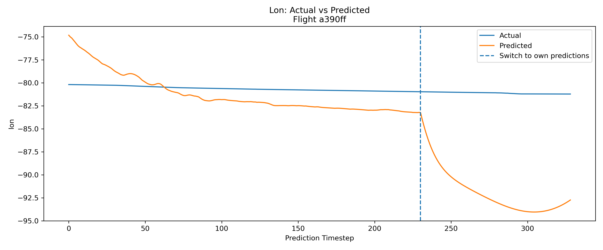
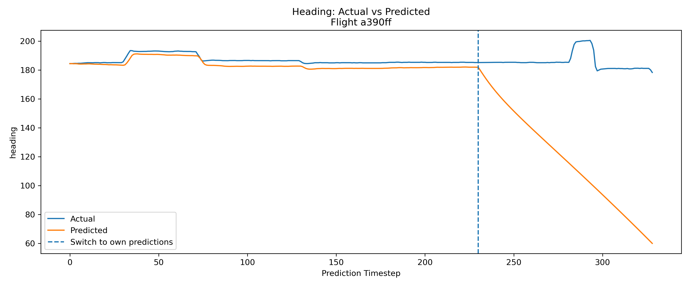 | 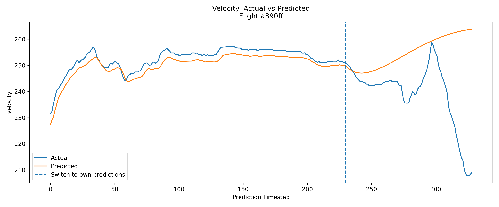
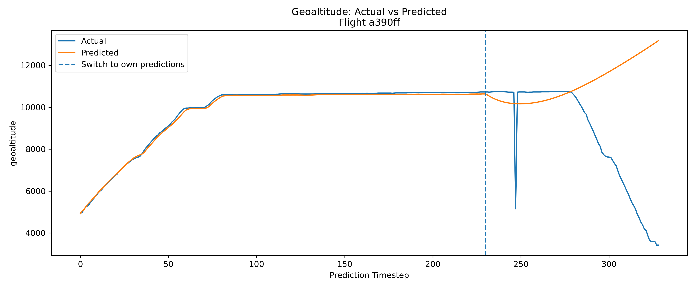 | 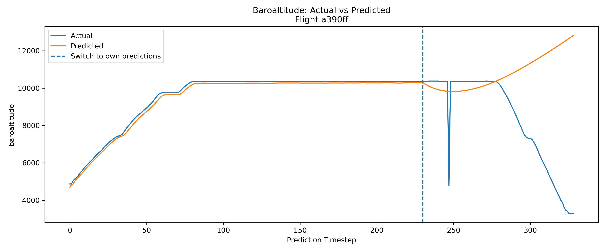
> **Fig 14** Six plots comparing LSTM predictions to ground truth ADS-B data. The plots represent predictions and ground truth values of the following state variables: latitude, longitude, heading, velocity, geoaltitude, and baroaltitude.

Across all six state channels, the vanilla LSTM's predictions are somewhat poor. When the model is only making individual timestep predictions using ADS-B lookback data, it is generally able to estimate the correct sequence of state values, with the exception of latitude and longitude. However, when the model switches to forecasting trajectories over a time horizon, its performance worsens substantially. In every state variable aside from velocity, the model's forecast follows a quadratic arc with no precedent in the prior data. The model is even unable to just follow a constant linear sequence, as a non-learning kinematic model might. Overall, these results would not be viable for use in a safety-critical context.


### Bidirectional LSTM Performance

These plots show the performance of the Bidirectional LSTM across all six state channels.
|  |  |
:--:|:--:
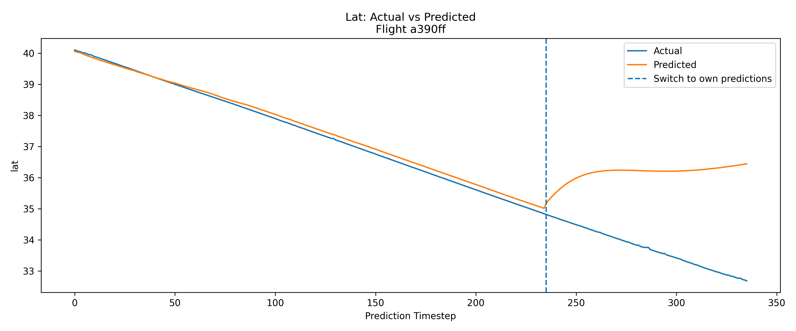 | 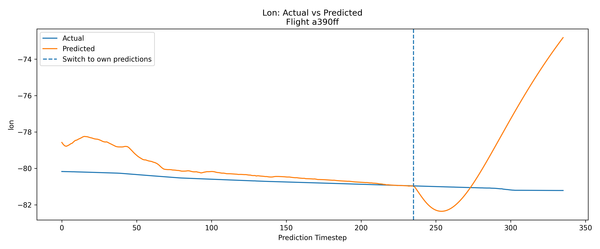
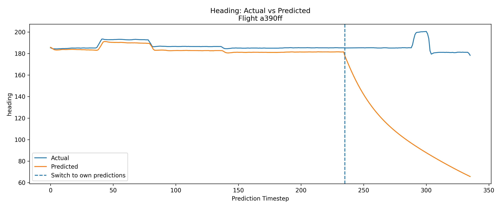 | 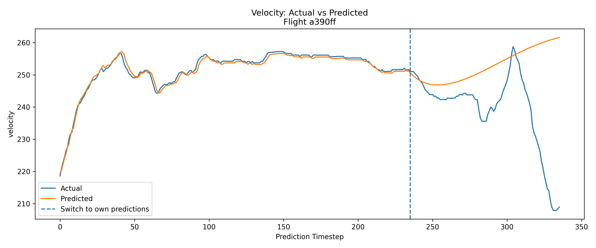
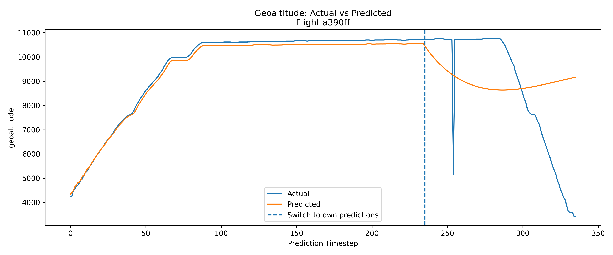 | 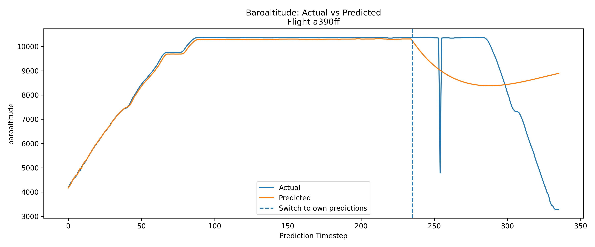
> **Fig 15** Six plots comparing BiLSTM predictions to ground truth ADS-B data. The plots represent predictions and ground truth values of the following state variables: latitude, longitude, heading, velocity, geoaltitude, and baroaltitude.

Across all six state channels, the BiLSTM's predictions do not show a substantial improvement from the vanilla LSTM's performance. The model does show relative improvement in the individual timestep predictions for latitude and longitude. However, the model still performs quite poorly when forecasting trajectories over a time horizon. The model's forecast continues to create quadratic arcs that do not follow the actual sequence of any state variables. The error seems to even be more substantial than that of the vanilla LSTM, particularly for longitude and heading. Overall, these results would also not be viable for use in a safety-critical context.

### BiLSTM With Deltas Performance

These plots show the performance of the Bidirectional LSTM with deltas across all six state channels.
|  |  |
:--:|:--:
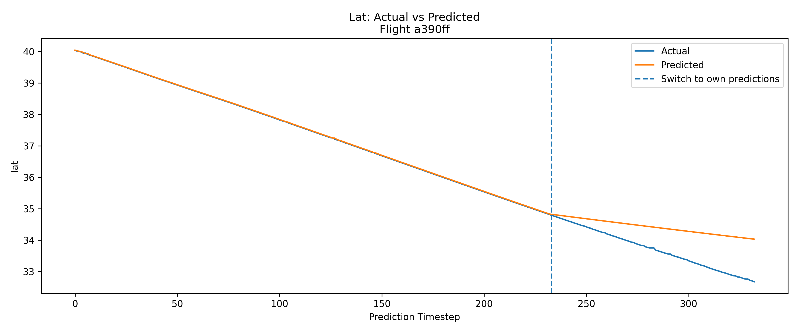 | 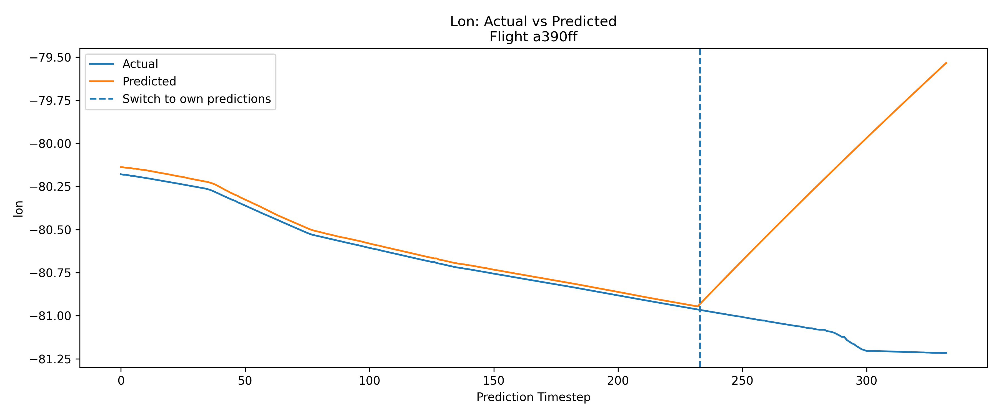
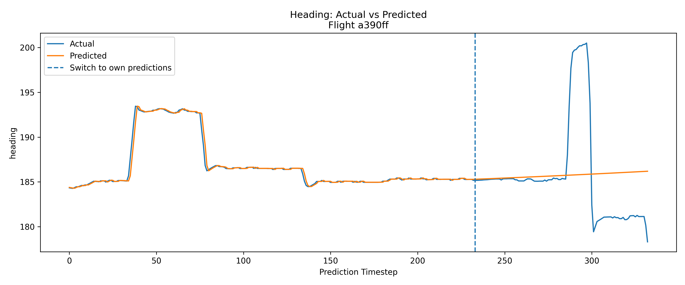 | 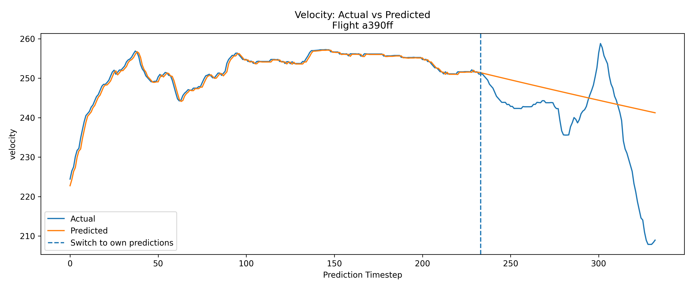
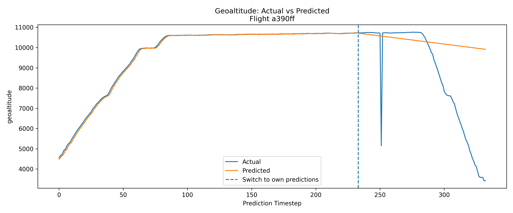 | 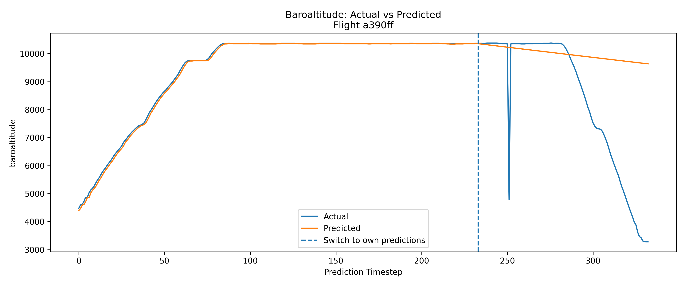
> **Fig 16** Six plots comparing BiLSTM delta predictions to ground truth ADS-B data. The plots represent predictions and ground truth values of the following state variables: latitude, longitude, heading, velocity, geoaltitude, and baroaltitude.

Across all six state channels, the incorporation of delta predictions shows a substantial improvement from the BiLSTM's performance. For individual timestep predictions, the delta variant closes the error gap between prediction and ground truth nearly perfectly. Additionally, the model's trajectory forecasting shows meaningful improvement from prior iterations. Longitude predictions specifically are still quite poor, but all other state variable predictions show plausible future trajectories that are generally in line with the ground truth futures. Overall, the error present in the forecasts of all state variables besides longitude is acceptable given that forecasts will be regenerated with frequent incoming ADS-B data.

## Conclusion and Future Work

In summary, we found very limited success utilizing an LSTM- or BiLSTM-based network for trajectory prediction, specifically by predicting changes in state variables rather than predicting absolute values. The final model was most successful with predicting a single timestep, or 10 seconds, into the future, as long as it received consistent ADS-B data updates to rely on for each subsequent prediction. The final model was less successful during simulated dropouts in which it was forced to rely on its own prediction sequence for future predictions; however, aside from longitude all state variable forecasts were plausible and in-line with ground truth trajectories.

Future work on this project would include two parallel explorations: improving the BiLSTM-based network and developing baselines of performance for comparison. To improve the BiLSTM-based network, substantially increasing the amount of training data could lead to improved results. While this project only evaluated a model trained on 24 hours of flight data, training on several days or months could result in improved pattern recognition and generalizability of the model's prediction capabiltiies. Another potential improvement would be extending the model to also incorporate an attention block or other transformer-based methods, which could help to strengthen context across datapoints in the flight trajectory.

For performance baselines, it would be valuable to compare the model to a classical physics-based model using kinematics for prediction. Since kinematic methods are so computationally efficient to run in real-time, they are extremely popular for UAVs performing tracking tasks. Therefore, a computationally hefty model such as a neural network would need to substantially outperform a kinematic model in order to be worth utilizing. Kinematic baselines are a common point of comparison in studies attempting a similar model as this project, so there is precedent for using them as an evaluation tool.
