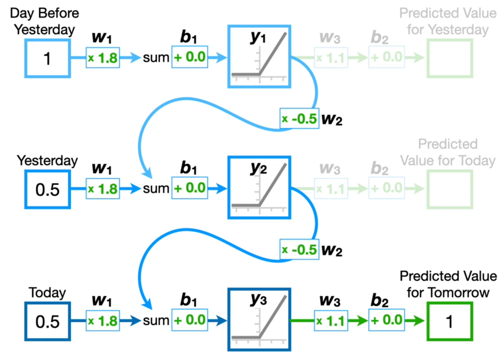
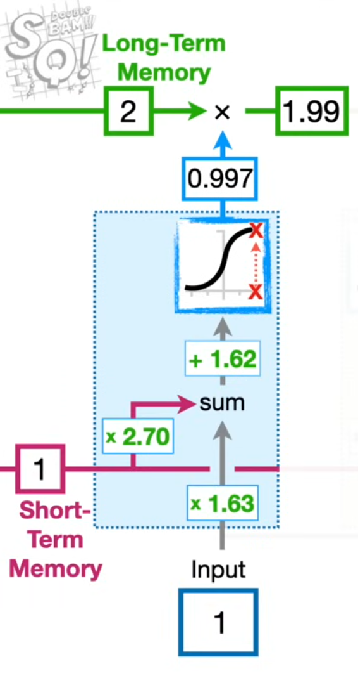
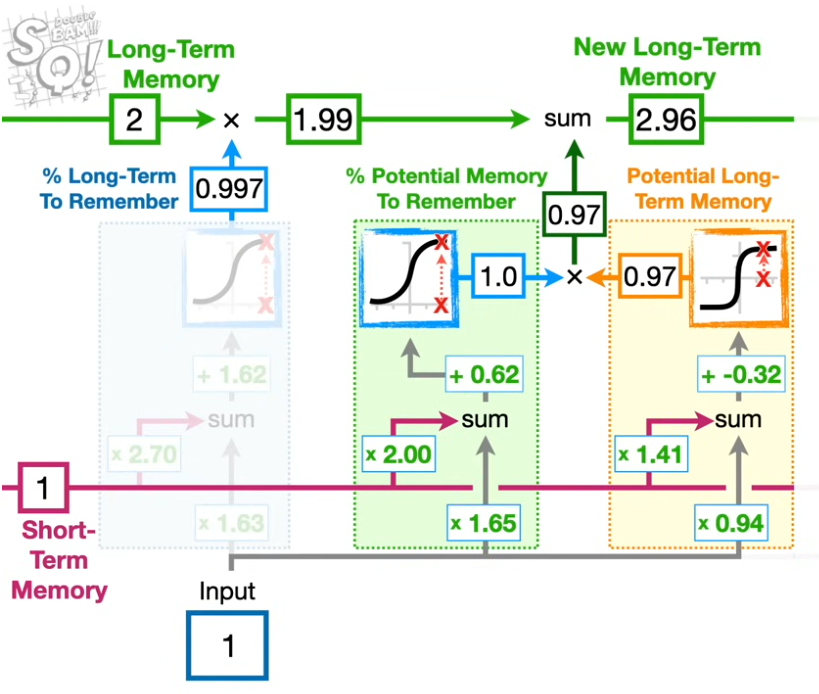
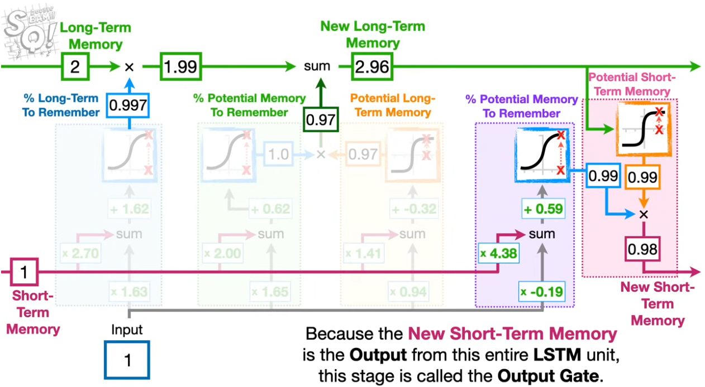

# Title

## Project Overview

## Intro (What/Why Are We Doing It)

### Problem Context and Motivation

(Ivy)

### How Do LSTMs Work?

#### Intro to Recurrent Neural Networks

Recurrent Neural Networks (RNNs) are a type of neural network capable of predicting future items in a sequence of temporal data. The RNN is made up of layers for each prior input in the sequence. Each layer utilizes a block called a Recurrent Unit, which calculates a "Hidden State" value to propagate information about prior inputs to the layer's own unit. This means that new sequence predictions are informed by all prior values in the given sequence. RNNs also use an identical set of weights and biases for each internal layer, meaning they can train quickly even with large sequences of data or with datasets of varying sizes.

> Fig. 1 Diagram of an unrolled Recurrent Neural Network predicting a new item in a 2-item sequence of stock prices.

However, the RNN's identical weights lead to a severe problem of RNNs: the vanishing/exploding gradient problem. Essentially, any set of weights will be reapplied to the Hidden State over and over again as the RNN's layers are unrolled. If those weights are greater than 1, the values in the Hidden States will be amplified by said value again and again until they are unreasonably high. Similarly, if those weights are less than 1, the values in the hidden states will shrink until they are near-zero. As a result, RNNs are not a reliable solution for any sequence prediction problems with input sequences greater than a few pieces of data.

#### LSTMs As Modified RNNs

Long Short-Term Memory (LSTM) is an extension of the vanilla RNN that eradicates the vanishing/exploding gradient problem. LSTM-based networks, unlike RNNs, maintain both a Hidden State (short-term memory) and a Cell State (long-term memory). Unlike the Hidden State, the Cell State does not include any tunable weights, preventing the vanishing/exploding gradient problem. The LSTM updates the Cell State and Hidden State by applying a set of three blocks to each input value in the given sequence.

The first block, the Forget Gate, determines the percentage of the long-term memory that will be kept in the Cell State going forward. This percentage is calculated by applying the sigmoid activation function to a weighted sum of the input value and the Hidden State value, which maps the value to a percentage between 0 and 1. The weights on these values are learned by the network during training.

> Fig Diagram of the Forget Gate in an LSTM unit, containing a sigmoid function to calculate percentage of long-term memory kept.

The second block, the Input Gate, determines what value to add to the long-term memory in the Cell State. This block applies the inverse tangent activation function to a weighted sum of the input value and the Hidden State value, which maps the value to a scale of -1 to 1. This value represents a potential value to add to the long-term memory. The block also utilizes the sigmoid activation function with weights, just like the Forget Gate, to determine how much of that potential value to actually add to the long-term memory. After both functions are run, the final new value is added to the existing long-term memory in the Cell State.

> Fig Diagram of the Input Gate in an LSTM unit, containing a tanh function to calculate new long-term memory, as well as a sigmoid function to calculate percentage of new long-term memory kept.

The third and final block, the Output Gate, determines what value to add to the short-term memory in the Hidden State, which is ultimately returned by the LSTM unit as a final value. This block does the same steps as the Input Gate, but instead of using the long-term memory to modify the short-term memory with inverse tangent and sigmoid, it does the reverse. In this way, the long-term memory's stability keeps the short-term memory from exploding and preserves information from earlier timesteps, while the short-term memory is most influenced by training weights and recent input values.

> Fig Diagram of the Output Gate in an LSTM unit, containing a tanh function to calculate new short-term memory, as well as a sigmoid function to calculate percentage of new short-term memory kept. The result of the Output Gate is the final output of the LSTM unit.

In practice, an LSTM-based network would apply the three blocks that make up a single LSTM unit to each item in the given sequence, in order. The resultant output of the final LSTM unit is the prediction for the next item in the sequence. The long-term memory and short-term memory work together to balance old information with new, while also avoiding the vanishing/exploding gradient problem that vanilla RNNs struggle with. As a result, LSTMs are a popular choice for sequence prediction in many contexts.

### Attention Blocks

## Methodology (How We Did It)

### Data Collection and Preprocessing

#### OpenSky Sensor Network

(Ivy)

#### Data Preprocessing

(Lily)

### LSTM Model Development

#### Architecture

(Lily)

#### Parameter Sweeps

(Ivy+Lily)
(needs images)

### LSTM-Attention Model Development

## Results (How It Went)

### Pre-Tuned LSTM vs Tuned LSTM

(Lily + Ivy)
(needs images)

### Tuned LSTM vs LSTM-Attention
